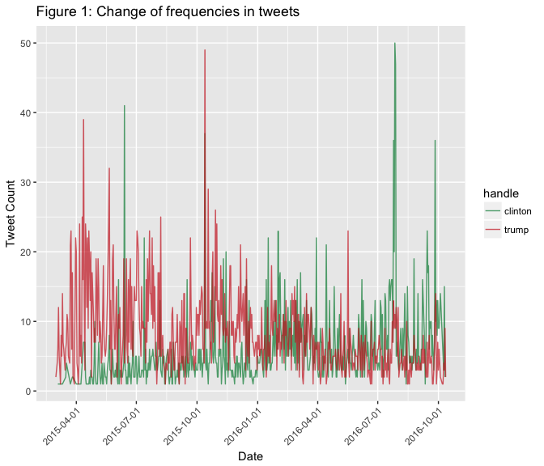
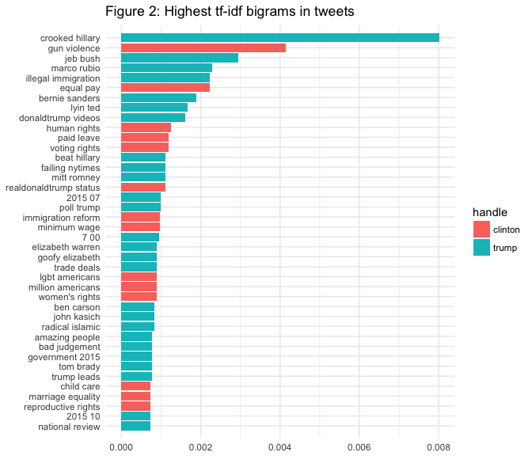
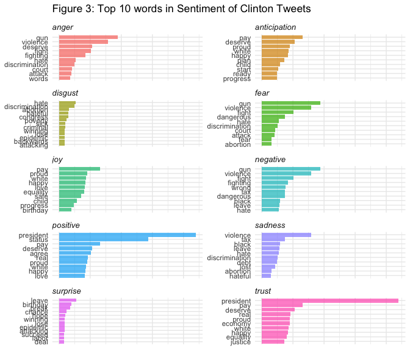
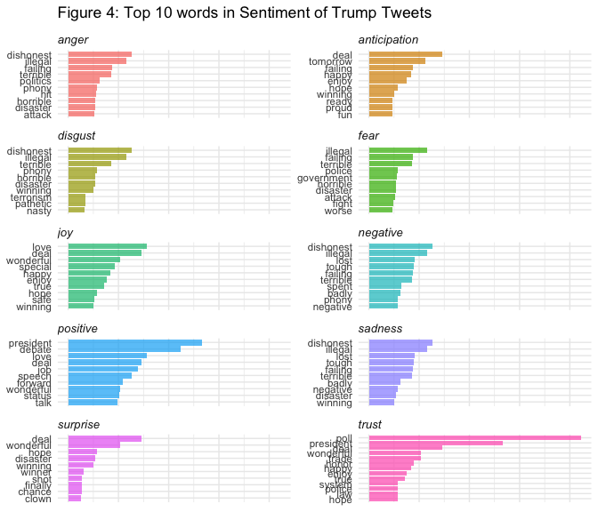
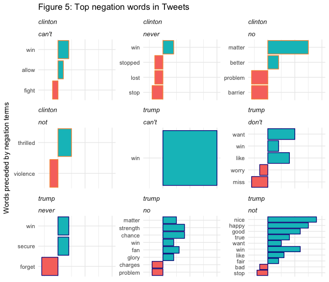
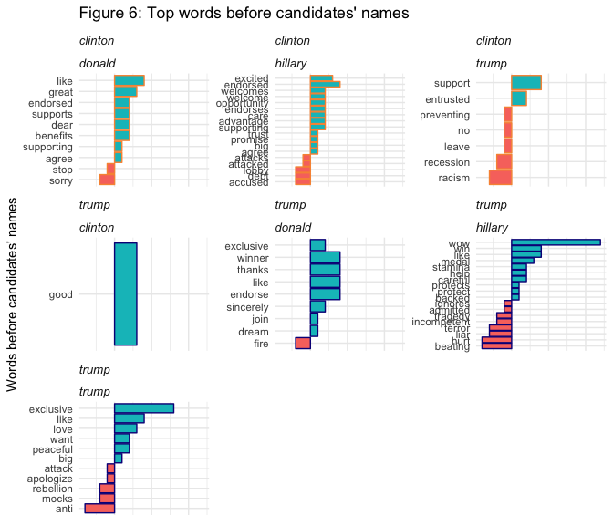
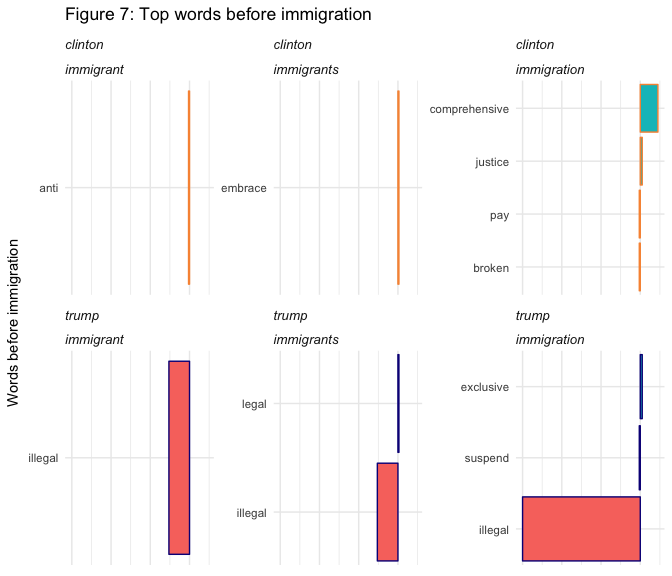
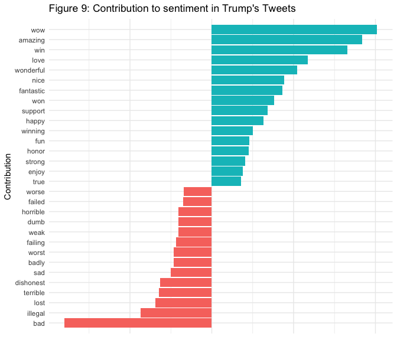
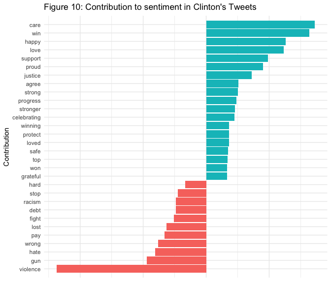

A Comparative Analysis of Hillary Clinton and Donald Trump's Twitter Usage
================
Yanning Cui Social Sciences Division ID:12145036
Jun 1, 2017

Introduction
------------

A large body of research argue that political leanings correlate with various factors. On average, **left-and-right leaning individuals express differently through their use of language in different political orientations (speeches, debates, and social media content)**.

During a presidential election, such language differences in orientations may reasonably influence voters' perceptions of a given candidate. In recent years, many scholars have begun through computerized methods to analyze political candidates' discourse to determine whether the candidates' linguistic forms may be differentially linked to particular aspects of their personalities, political parties, or their stances on important topics such as healthcare, education, immigration, abortion, or economy.

The purpose of this study is to contribute to the growing body of quantitative research on the discourse and personalities of politicians. **In order to discover how Republican and Democrat candidates use Twitter during the campaign, I conduct a content analysis of Hillary Clinton and Donald Trump's tweets from 2016 election season. I compare the two candidates' tweets from the 2016 presidential election to find any systematic differences between the two and model the outcomes using a logistics regression model.**

Related Work and Hypothesis
---------------------------

### Literature

I discuss three aspects of literature:

1.  Value-centered theoretical frameworks: this section summarizes different models and approaches for measuring psychological and language use differences between liberals and conservatives.

2.  Twitter analyses and computational approaches: this section introduces how various applications of Twitter analyses are incorporated in social research, and how computerized methods gain widespread use

3.  Linguistic Inquiry and Word Count (LIWC): this section summarizes the most recent studies that use computational linguistic analytical tools to analyze content from speeches, debates, and social networking platforms

### Hypotheses

Based on the literature, I hypothesize that:

*H1: Democrat candidate Hillary Clinton emphasizes the perception of uniqueness, and Republican candidate Donald Trump emphasizes group memberships.*

*H2: Democrat candidate Hilary Clinton's language contains more positive sentiments and emotions and more swear words, while Republican candidate Donald Trump uses more negation words and more negative sentiments and emotions, including anger and sadness.*

*H3: Republican candidate Donald Trump are more likely to emphasizes death, achievement, and religion than his Democratic counterpart.*

I plan to test these hypotheses using a content analysis of tweets from Hillary Clinton and Donald Trump during the 2016 Elections. For outcomes where there is no sufficient evidence in the literature or features that have not been comprehensively discussed before, the analysis is treated as exploratory.

Data
----

This study uses **a public Twitter dataset that consists of tweets of the official Twitter accounts of the Republican and Democratic candidates: Hilary Clinton (@HillaryClinton) and Donald Trump (@realDonaldTrump)**.

The original dataset contains 11,770 tweets from 2014-01-01 to 2016-10-14 from the candidates' official Twitter accounts with no retweets. For the purpose of the study, I choose a sub-dataset that contains a total of **7,901 tweets** from **2015-03-01 to 2016-10-14**, which is roughly from the launch to the end of 2016 presidential run (On March 18, 2015, Donald Trump formed an exploratory committee in preparation for a possible run for president on the Republican Party ticket; on April 12, 2015, former Secretary of State Hillary Clinton formally announced her candidacy for the presidential nomination of the Democratic Party).

Tweets were obtained through javascript scraping of the browser twitter timeline rather than a Tweepy python API or the twitter timeline API. Because the dataset contains no retweets, it will provide us with more accurate insights about the language use difference between the two candidates, rather than the original author of the tweets.

Although there have been data scientists arguing that Trump???s campaign team and himself are using the same account to spread tweets, there are no formal evidence proving that the tweets are from different people. Therefore, I will treat all tweets from the two official accounts as political orientation of the two candidates and include them in the analysis as they represent the activity, opinions, and ideas of the two.

Each tweet contains its id, time, text, link, and author (Hillary Clinton/realDonaldTrump). The dataset can be downloaded from the Kaggle website. (<https://www.kaggle.com/speckledpingu/RawTwitterFeeds>)

Research design and Method
--------------------------

The analysis consists of three parts:

1.  Investigate the most differentiating terms for Republican and Democrat candidate, Donald Trump and Hillary Clinton (data exploration)

2.  Investigate sentiments and emotions manifested in tweets for each candidate (data exploration)

3.  Investigate the most differentiating features of tweets for the two candidates (logistics regression: significant features)

The first two parts of the analysis utilizes **statistical and text mining tools in R**. The third part involves finding predictors of political orientation using categories from **LIWC**. Then I use related predictors to run a logistic regression and find out the most significant features.

### Data cleaning and preprocessing

normalization/stemming, stop words removal, and TF/IDF

### Data exploration:

**tf-idf bigrams, words related to sentiments/emotions, change of sentiments over time** (The Syuzhet package supports the use of different Sentiment Analysis lexicons. The **NRC method**, for example, evaluates a body of text and **returns positive values for eight different emotions (anger, anticipation, disgust, fear, joy, sadness, surprise, and trust)**, and **two sentiments (negative and positive)**. You can compute these scores with the get\_nrc\_sentiment() function.)

### Logistic regression

#### Annotate every tweet with LIWC software

(**The Linguistic Inquiry and Word Count (LIWC) software** provides a set of dictionaries that group words by category (i.e. i-related words, religion-related words, family-related words, achievement-related words). LIWC calculates the percentages of words of specified categories appearing in the submitted text. LIWC has been validated and successfully used by social science researchers in the past. )

#### Features to test the hypotheses:

Based on the hypotheses, I focus on 12 dimensions in 3 major categories in order to profile political sentiment: **1st person singular pronouns, 1st person plural pronouns, positive emotions, negative emotions, negation words, sadness, anxiety, anger, swear words, death, achievement, and religion**.

#### Logistic regression: significance of different features, compute odds ratio

Preparation
-----------

### Load libraries

``` r
library(stringr)
library(tidyr)
library(knitr)
library(scales)
library(reshape2)
library(scales)
library(viridis)    
library(tidyverse)      
library(tidytext)       
library(ggplot2)
library(lubridate)  
library(dplyr)
library(SnowballC)  
library(RTextTools)
library(syuzhet)
library(modelr)
library(broom)
library(caret)
library(sparklyr)
library(caTools)
library(data.table)
library(NLP)
```

### Load Data

Trump and Clinton tweets available at kaggle: <https://www.kaggle.com/speckledpingu/rawtwitterfeeds>

``` r
#read in data
trump <- read_csv("thesis_data/DonaldTrump2014-01-01To2016-10-14Tweets.csv") %>%
  mutate(handle = "trump")
clinton <- read_csv("thesis_data/HillaryClinton2014-01-01To2016-10-14Tweets.csv") %>%
  mutate(handle = "clinton")

#append two datasets
raw_tweet <- rbind(clinton, trump) %>%
  select(-X1, -retweet)

#create a new column: Date
cols <- c( 'year', 'date')
raw_tweet$Date <- apply( raw_tweet[ , cols ] , 1 , paste , collapse = "/" )

#remove unnecessary columns
raw_tweet <- raw_tweet %>%
  select(-date, -year) 
raw_tweet <- raw_tweet %>%
  mutate(date = Date) %>%
  select(-Date)

raw_tweet
```

    ## # A tibble: 11,770 <U+00D7> 6
    ##          id                                      link
    ##       <dbl>                                     <chr>
    ## 1  7.85e+17 /HillaryClinton/status/785272428905791489
    ## 2  7.85e+17 /HillaryClinton/status/785325012152713216
    ## 3  7.85e+17 /HillaryClinton/status/785282982261190656
    ## 4  7.87e+17 /HillaryClinton/status/786963642080227328
    ## 5  7.87e+17 /HillaryClinton/status/786958117531742208
    ## 6  7.87e+17 /HillaryClinton/status/786956647306522624
    ## 7  7.87e+17 /HillaryClinton/status/786956397766385665
    ## 8  7.87e+17 /HillaryClinton/status/786955912409907200
    ## 9  7.87e+17 /HillaryClinton/status/786954388682203141
    ## 10 7.87e+17 /HillaryClinton/status/786954200584454144
    ## # ... with 11,760 more rows, and 4 more variables: text <chr>,
    ## #   author <chr>, handle <chr>, date <chr>

### Extract month and year variable

``` r
tweet <- raw_tweet %>%
  mutate(month = month(ymd(date))) %>% #extract month
  mutate(year = year(ymd(date))) %>% #extract year
  mutate(month = month.abb[(month)]) %>% #convert a numeric month to a month abbreviation
  mutate(month = factor(month, month.abb, ordered=TRUE)) %>%
  filter(date >= as.Date("2015-03-01")) #formally launch

tweet
```

    ## # A tibble: 7,901 <U+00D7> 8
    ##          id                                      link
    ##       <dbl>                                     <chr>
    ## 1  7.85e+17 /HillaryClinton/status/785272428905791489
    ## 2  7.85e+17 /HillaryClinton/status/785325012152713216
    ## 3  7.85e+17 /HillaryClinton/status/785282982261190656
    ## 4  7.87e+17 /HillaryClinton/status/786963642080227328
    ## 5  7.87e+17 /HillaryClinton/status/786958117531742208
    ## 6  7.87e+17 /HillaryClinton/status/786956647306522624
    ## 7  7.87e+17 /HillaryClinton/status/786956397766385665
    ## 8  7.87e+17 /HillaryClinton/status/786955912409907200
    ## 9  7.87e+17 /HillaryClinton/status/786954388682203141
    ## 10 7.87e+17 /HillaryClinton/status/786954200584454144
    ## # ... with 7,891 more rows, and 6 more variables: text <chr>,
    ## #   author <chr>, handle <chr>, date <chr>, month <ord>, year <int>

``` r
#write_csv(tweet, "thesis_data/tidy_tweet.csv")
```

### Distribution of tweets by candidate

``` r
#frequency changes detected
frequency_handle <- tweet %>%
  count(date, handle)

ggplot(frequency_handle, aes(as.Date(date), n), group = handle) + 
   geom_line(size = 0.5, alpha = 0.7, aes(color = handle)) +
   scale_colour_manual(values = c("springgreen4", "firebrick3")) +
   scale_x_date(labels = date_format("%Y-%m-%d"), date_breaks = "3 months") +   
   xlab("Date") + 
   ylab("Tweet Count") +
   theme(axis.text.x = element_text(angle = 45, hjust = 1)) +
   labs(title = "Figure 1: Change of frequencies in tweets")
```



``` r
   #ggsave(file="frequency_handle.png")
```

### Preprocessing: tokenization, normalization, removing stop words

``` r
#remove stop words
data("stop_words")

#I manually define some stop words and store them in a csv file
new_stopwords <- read_csv("thesis_data/customized_stopwords.csv")

#add new stop words to stopwords list
newstop <- rbind(stop_words, new_stopwords)

reg <- "([^A-Za-z\\d#@']|'(?![A-Za-z\\d#@]))"

tweet <- tweet %>%
  filter(!str_detect(text, '^"')) %>%
  mutate(text = str_replace_all(text, "https://t.co/[A-Za-z\\d]+|&amp;", "")) 

# Clean text to remove odd characters
tweet$text <- sapply(tweet$text,function(row) iconv(row, "latin1", "ASCII", sub=""))

tweet_tidy <- tweet %>%
  unnest_tokens(word, text, token = "regex", pattern = reg) %>%
  #mutate(word = wordStem(word, "english")) %>% #stem words 
  filter(!word %in% newstop$word,
         str_detect(word, "[a-z]"))
```

Part 1: Semantic world in Tweets
--------------------------------

Many interesting text analyses are based on the relationships between words, whether examining which words tend to follow others immediately, or that tend to co-occur within the same documents.

Therefore, I will explore **ngrams**, which tokenizes by pairs of adjacent words rather than by individual ones.

### 1.1 Bigrams

#### Top 10 bigrams for each candidate

``` r
#function using tidyr
bigram <- function(input){
  bigram <- tweet %>%  
  filter(handle == input) %>%
  unnest_tokens(bigram, text, token = "ngrams", n = 2) %>%
  #separate biagrams and remove cases where either is a stop-word
  separate(bigram, c("word1", "word2"), sep = " ") %>%
  filter(!word1 %in% newstop$word) %>%
  filter(!word2 %in% newstop$word) %>% 
  count(word1, word2, sort = TRUE) %>%
  unite(bigram, word1, word2, sep = " ")
  return(bigram)
}

head(bigram("trump"),10)
```

    ## # A tibble: 10 <U+00D7> 2
    ##                 bigram     n
    ##                  <chr> <int>
    ## 1      crooked hillary   144
    ## 2      hillary clinton   129
    ## 3         donald trump   126
    ## 4             ted cruz    84
    ## 5             jeb bush    53
    ## 6       south carolina    50
    ## 7          marco rubio    41
    ## 8  illegal immigration    40
    ## 9       bernie sanders    34
    ## 10     president obama    34

``` r
head(bigram("clinton"),10)
```

    ## # A tibble: 10 <U+00D7> 2
    ##                bigram     n
    ##                 <chr> <int>
    ## 1        donald trump   148
    ## 2        gun violence    56
    ## 3         health care    40
    ## 4           equal pay    30
    ## 5         white house    27
    ## 6      climate change    24
    ## 7  planned parenthood    22
    ## 8      donald trump's    21
    ## 9        human rights    17
    ## 10      supreme court    17

### 1.2 Quantify what a document is about: Finding the most representative terms for each candidate

Although removing stop words reduces the dimensionality of term space, it is not a very sophisticated approach to adjusting term frequency for commonly used words. After removing stop words, I start to analyze the most frequent terms in the two candidates' language. However, usually we care more about how rare a term is, not just the frequency. Many terms used by a candidate will also be used by his/her rival, not giving much insight into the tweet's author. For example, the term "win" or "Trump" is used frequently in the dataset by both candidates, but it is not helpful to distinguish them; however, there are terms that are used much less frequently, but almost exclusively by certain candidate. Those are the words (or groups of words) that I look for in order to analyze the differences more accurately.

One way to measure how important a word may be is its term frequency (tf): how frequently a word occurs in a document. Another approach is to look at a term's inverse document frequency (idf), which decreases the weight for commonly used words and increases the weight for words that are not used very often in a collection of documents. We can combine these two to calculate a term's tf-idf (the two quantities multiplied together): the frequency of a term adjusted for how rarely it is used (Silge & Robinson, 2016).

The idea of tf-idf is to find the most important words for the content in the group of tweets by Trump and Clinton. By calculating tf-idf, we attempt to find the words that are important (i.e., common) in a tweet, but not too common. It is meaningless to quantify the importance of different words in a single tweet, because every tweet is only 140 words in length. Therefore, I treat tweets from Trump (or Clinton) as a corpus. Then the statistic tf-idf is intended to measure how important a word is to a candidate in his or her corpus. The value of tf-idf increases proportionally to the frequency that a word appears in the document, but is counteracting by the frequency of that word in the corpus. Term Frequency - Inverse document frequency \[tf-idf\] is calculated for each word using the formula (Vijayarani, Ilamathi, & Nithya, 2015):

**tf-idf (t, f, d) = tf (t, d) \* idf (t, d)**

I use this formula to calculate the most important terms (bigrams) in each candidate's tweets.

``` r
#tokenize
tweet_bigrams <- tweet %>%
  filter(!str_detect(text, '^"')) %>%
  mutate(text = str_replace_all(text, "https://t.co/[A-Za-z\\d]+|&amp;", "")) %>%
  unnest_tokens(bigram, text, token = "ngrams", n = 2)

#separate biagrams and remove cases where either is a stop-word
bigrams_separated <- tweet_bigrams %>%
  separate(bigram, c("word1", "word2"), sep = " ")

bigrams_filtered <- bigrams_separated %>%
  filter(!word1 %in% newstop$word) %>%
  filter(!word2 %in% newstop$word)

#new bigram counts:
bigram_counts <- bigrams_filtered %>% 
  count(word1, word2, handle, sort = TRUE)

#unite
bigrams_united <- bigrams_filtered %>%
  unite(bigram, word1, word2, sep = " ")

person_bigram <- bigrams_united %>%
  count(handle, bigram, sort = TRUE) %>%
  ungroup()

total_bigram <- person_bigram %>% 
  group_by(handle) %>% 
  summarize(total = sum(n))

tfidf_bigram <- left_join(person_bigram, total_bigram) %>%
  bind_tf_idf(bigram, handle, n)
```

**Let's look at terms with high tf-idf in each candidate's tweets.**

``` r
tfidf <- tfidf_bigram %>%
  arrange(desc(tf_idf)) %>%
  mutate(bigram = factor(bigram, levels = rev(unique(bigram)))) %>% 
  top_n(40) %>%
  ggplot(aes(bigram, tf_idf, fill = handle)) +
  geom_col() +
  labs(title = "Figure 2: Highest tf-idf bigrams in tweets", x = NULL, y = "tf-idf") +
  coord_flip() +
  theme_minimal(base_size = 11) +
  scale_color_viridis(end = 0.75, discrete=TRUE, direction = -1,option = 'C') +
        scale_x_discrete(expand=c(0.02,0)) +
        theme(strip.text=element_text(hjust=0)) +
        theme(strip.text = element_text(face = "italic", size=10)) +
        theme(axis.title.x=element_blank()) +
        theme(axis.ticks.x=element_blank())
        #ggsave(file="tfidf_bigram.png")

tfidf
```



Part 2: Sentiment Analysis
--------------------------

### 2.1 Sentiment-topic words (top words in each sentiment)

##### Clinton

``` r
newstop2 <- read_csv("thesis_data/customized_stopwords2.csv")
nrc_word_counts <- tweet_tidy %>%
  filter(!word %in% newstop2$word,
         str_detect(word, "[a-z]")) %>%
  inner_join(get_sentiments("nrc")) %>%
  count(word, handle, sentiment, sort = TRUE) %>%
  ungroup()

#top 10 words for each sentiment by clinton
nrc_word_counts %>%
  filter(handle == "clinton") %>%
  group_by(sentiment) %>%
  top_n(10) %>%
  ggplot(aes(reorder(word, n), n, fill = sentiment)) +
    geom_bar(alpha = 0.7, stat = "identity", show.legend = FALSE) +
    facet_wrap(~sentiment, nrow = 6, scales = "free_y") +
    labs(y = "Contribution to sentiment", x = NULL) +
    coord_flip() +
    theme_minimal(base_size = 11) +
    labs(title = "Figure 3: Top 10 words in Sentiment of Clinton Tweets") +
    scale_color_viridis(end = 0.75, discrete=TRUE, direction = -1,option = 'C') +
    scale_x_discrete(expand=c(0.02,0)) +
    theme(strip.text=element_text(hjust=0)) +
    theme(strip.text = element_text(face = "italic", size=10)) +
    theme(axis.title.x=element_blank()) +
    theme(axis.ticks.x=element_blank()) +
    theme(axis.text.x=element_blank())
```



``` r
    #ggsave(file="top_10_words_sentiment_clinton.png")
```

##### Trump

``` r
#trump
nrc_word_counts %>%
  filter(handle == "trump") %>%
  group_by(sentiment) %>%
  top_n(10) %>%
  ggplot(aes(reorder(word, n), n, fill = sentiment)) +
    geom_bar(alpha = 0.7, stat = "identity", show.legend = FALSE) +
    facet_wrap(~sentiment, nrow = 6, scales = "free_y") +
    labs(y = "Contribution to sentiment", x = NULL) +
    coord_flip() +
    theme_minimal(base_size = 11) +
    labs(title = "Figure 4: Top 10 words in Sentiment of Trump Tweets") +
    scale_color_viridis(end = 0.75, discrete=TRUE, direction = -1,option = 'C') +
    scale_x_discrete(expand=c(0.02,0)) +
    theme(strip.text=element_text(hjust=0)) +
    theme(strip.text = element_text(face = "italic", size=10)) +
    theme(axis.title.x=element_blank()) +
    theme(axis.ticks.x=element_blank()) +
    theme(axis.text.x=element_blank()) 
```



``` r
    #ggsave(file="top_10_words_sentiment_trump.png")
```

Since the sentiment dictionary cannot detect **negators, amplifiers, de-amplifiers, and adversative conjunctions** (phrases like 'not my president' might not be correctly detected).

We could then define a list of six words that we suspect are used in negation, such as no, not, and without, and visualize the sentiment-associated words that most often followed them. This shows the words that most often contributed in the wrong direction.

### 2.2 Words proceded by negation terms, words before candidates' names, and words related to other important political terms

``` r
#how often words are preceded by a word like "not""
negation_words <- c("not", "no", "never", "anti", "without", "can't", "don't", "won't")

AFINN <- get_sentiments("afinn")

negated_words <- bigrams_separated %>%
  filter(word1 %in% negation_words) %>%
  inner_join(AFINN, by = c(word2 = "word")) %>%
  count(word1, word2, handle, score, sort = TRUE) %>%
  ungroup()

negated_words %>%
  mutate(contribution = n * score) %>%
  arrange(desc(abs(contribution))) %>%
  head(40) %>%
  mutate(word2 = reorder(word2, contribution)) %>%
  ggplot(aes(word2, n * score, fill = n * score > 0, color = handle)) +
  scale_colour_manual(values = c("springgreen4", "firebrick3")) +
  facet_wrap(handle~word1, scales = "free_y") +
  geom_col(show.legend = FALSE) +
  xlab("Words preceded by negation terms") +
  ylab("Sentiment score * number of occurrences") +
  coord_flip() +
  theme_minimal(base_size = 11) +
    labs(title = "Figure 5: Top negation words in Tweets") +
    scale_color_viridis(end = 0.75, discrete=TRUE, direction = -1,option = 'C') +
    scale_x_discrete(expand=c(0.02,0)) +
    theme(strip.text=element_text(hjust=0)) +
    theme(strip.text = element_text(face = "italic", size=10)) +
    theme(axis.title.x=element_blank()) +
    theme(axis.ticks.x=element_blank()) +
    theme(axis.text.x=element_blank()) 
```



``` r
    #ggsave(file="top_negation_words.png")
```

#### How do candidates talk about themselves and their opponent?

``` r
name <- c("trump", "clinton", "hillary", "donald", "Trump", "Clinton", "Hillary", "Donald")

name_words <- bigrams_separated %>%
  filter(word2 %in% name) %>%
  inner_join(AFINN, by = c(word1 = "word")) %>%
  count(word1, word2, handle, score, sort = TRUE) %>%
  ungroup()

name_words %>%
  mutate(contribution = n * score) %>%
  arrange(desc(abs(contribution))) %>%
  head(100) %>%
  mutate(word1 = reorder(word1, contribution)) %>%
  ggplot(aes(word1, n * score, fill = n * score > 0, color = handle)) +
  facet_wrap(handle~word2, scales = "free_y") +
  geom_col(show.legend = FALSE) +
  xlab("Words before candidates' names") +
  ylab("Sentiment score * number of occurrences") +
  coord_flip() +
  theme_minimal(base_size = 11) +
    labs(title = "Figure 6: Top words before candidates' names") +
    scale_color_viridis(end = 0.75, discrete=TRUE, direction = -1,option = 'C') +
    scale_x_discrete(expand=c(0.02,0)) +
    theme(strip.text=element_text(hjust=0)) +
    theme(strip.text = element_text(face = "italic", size=10)) +
    theme(axis.title.x=element_blank()) +
    theme(axis.ticks.x=element_blank()) +
    theme(axis.text.x=element_blank()) 
```



``` r
    #ggsave(file="top_words_names.png")
```

#### How does each candidate talk about immigration?

``` r
immigration <- c("immigration", "immigrant", "immigrants", "immigrate")

immigration_words <- bigrams_separated %>%
  filter(word2 %in% immigration) %>%
  inner_join(AFINN, by = c(word1 = "word")) %>%
  count(word1, word2, handle, score, sort = TRUE) %>%
  ungroup()

immigration_words %>%
  mutate(contribution = n * score) %>%
  arrange(desc(abs(contribution))) %>%
  head(100) %>%
  mutate(word1 = reorder(word1, contribution)) %>%
  ggplot(aes(word1, n * score, fill = n * score > 0, color = handle)) +
  facet_wrap(handle~word2, scales = "free_y") +
  geom_col(show.legend = FALSE) +
  xlab("Words before immigration") +
  ylab("Sentiment score * number of occurrences") +
  coord_flip() +
  theme_minimal(base_size = 11) +
    labs(title = "Figure 7: Top words before immigration") +
    scale_color_viridis(end = 0.75, discrete=TRUE, direction = -1,option = 'C') +
    scale_x_discrete(expand=c(0.02,0)) +
    theme(strip.text=element_text(hjust=0)) +
    theme(strip.text = element_text(face = "italic", size=10)) +
    theme(axis.title.x=element_blank()) +
    theme(axis.ticks.x=element_blank()) +
    theme(axis.text.x=element_blank()) 
```



``` r
    #ggsave(file="top_words_immigration.png")
```

### 2.3 Change of sentiments by month in 2016

Get sentiments and emotions and calculate the mean of each sentiment/emotion

**Change of sentiments (positive/negative)**

``` r
tweet$sentiment <- get_sentiment(tweet$text) %>% 
  as.numeric()

#look at the mean sentiment scores for each candidate
clinton_average <- tweet %>%
  filter(handle == "clinton") %>%
  #filter(year == 2016) %>%
  group_by(year)%>% 
  summarise(Mean=mean(sentiment), Max=max(sentiment), Min=min(sentiment), Median=median(sentiment), Std=sd(sentiment), Variance = var(sentiment)) %>%
  mutate(handle = "clinton")

trump_average <- tweet %>%
  filter(handle == "trump") %>%
  #filter(year == 2016) %>%
  group_by(year)%>% 
  summarise(Mean=mean(sentiment), Max=max(sentiment), Min=min(sentiment), Median=median(sentiment), Std=sd(sentiment), Variance = var(sentiment)) %>%
  mutate(handle = "trump")

average <- rbind(clinton_average, trump_average)
average
```

    ## # A tibble: 4 <U+00D7> 8
    ##    year      Mean   Max   Min Median      Std Variance  handle
    ## * <int>     <dbl> <dbl> <dbl>  <dbl>    <dbl>    <dbl>   <chr>
    ## 1  2015 0.4312034  5.35 -4.05   0.50 1.134032 1.286030 clinton
    ## 2  2016 0.2495408  4.40 -3.90   0.25 1.134431 1.286933 clinton
    ## 3  2015 0.4125546  4.70 -4.95   0.50 1.199980 1.439952   trump
    ## 4  2016 0.1703177  5.30 -4.50   0.30 1.321653 1.746766   trump

``` r
#write.csv(average, "thesis_data/average_sentiment_year.csv")
```

#### Let's verify the result!

``` r
#the most positive sentiment
positive <- tweet %>%
  arrange(desc(sentiment)) %>%
  select(handle, date, sentiment, text) %>% 
  head(1)
as.String(positive)
```

    ## clinton
    ## 2015/6/26
    ## 5.35
    ## Proud to celebrate a historic victory for marriage equality& the courage & determination of LGBT Americans who made it possible. -H

``` r
#the most negative sentiment
negative <- tweet %>%
  arrange(desc(sentiment)) %>%
  select(handle, date, sentiment, text) %>% 
  tail(1)
as.String(negative)
```

    ## trump
    ## 2015/8/10
    ## -4.95
    ## We must stop the crime and killing machine that is illegal immigration. Rampant problems will only get worse. Take back our country!

**Change of emotions (8 categories)**

``` r
nrc_tweet <- cbind(tweet, get_nrc_sentiment(tweet$text)) 

nrc_clinton <- nrc_tweet %>% 
  filter(handle == "clinton") %>%
  group_by(year) %>%
  summarise(mean_angry=mean(anger), mean_anticipation=mean(anticipation), mean_disgust=mean(disgust), mean_fear=mean(fear), mean_joy=mean(joy), mean_sad=mean(sadness), mean_surprise=mean(surprise), mean_trust=mean(trust), mean_positive=mean(positive), mean_negative=mean(negative)) %>%
  mutate(handle = "clinton")

nrc_trump <- nrc_tweet %>% 
  filter(handle == "trump") %>%
  group_by(year) %>%
  summarise(mean_angry=mean(anger), mean_anticipation=mean(anticipation), mean_disgust=mean(disgust), mean_fear=mean(fear), mean_joy=mean(joy), mean_sad=mean(sadness), mean_surprise=mean(surprise), mean_trust=mean(trust), mean_positive=mean(positive), mean_negative=mean(negative)) %>%
  mutate(handle = "trump")

nrc_average <- rbind(nrc_clinton, nrc_trump)
nrc_average
```

    ## # A tibble: 4 <U+00D7> 12
    ##    year mean_angry mean_anticipation mean_disgust mean_fear  mean_joy
    ## * <int>      <dbl>             <dbl>        <dbl>     <dbl>     <dbl>
    ## 1  2015  0.3716720         0.5516507    0.1416400 0.4227902 0.4440895
    ## 2  2016  0.3983927         0.4644087    0.1802526 0.4144661 0.4001148
    ## 3  2015  0.3788210         0.5403930    0.2620087 0.3864629 0.4263100
    ## 4  2016  0.4679021         0.4116479    0.2991396 0.4308405 0.3467902
    ## # ... with 6 more variables: mean_sad <dbl>, mean_surprise <dbl>,
    ## #   mean_trust <dbl>, mean_positive <dbl>, mean_negative <dbl>,
    ## #   handle <chr>

``` r
#write.csv(nrc_average, "thesis_data/average_nrc_sentiment_year.csv")
```

### Positive and negative contribution of each word

It's worth looking deeper to understand why some months ended up more positive than others. For that, I examine the total positive and negative contributions of each word for every candidate.

#### Clinton

``` r
tweet_tidy %>%
  filter(handle == "clinton") %>%
  inner_join(get_sentiments("afinn"), by = "word") %>%
  group_by(word) %>%
  summarize(occurences = n(),
            contribution = sum(score)) %>%
  top_n(30, abs(contribution)) %>%
  mutate(word = reorder(word, contribution)) %>%
  ggplot(aes(word, contribution, fill = contribution > 0)) +
  geom_col(show.legend = FALSE) +
  coord_flip() +
  theme_minimal(base_size = 11) +
  labs(title = "Figure 10: Contribution to sentiment in Clinton's Tweets", x = "Contribution", y = "Word") +
  scale_color_viridis(end = 0.75, direction = -1,option = 'C') +
  scale_x_discrete(expand=c(0.02,0)) +
  theme(strip.text=element_text(hjust=0)) +
  theme(strip.text = element_text(face = "italic", size=10)) +
  theme(axis.title.x=element_blank()) +
  theme(axis.ticks.x=element_blank()) +
  theme(axis.text.x=element_blank()) 
```



``` r
  #ggsave(file="contribution_sentiment_clinton.png")
```

#### Trump

``` r
tweet_tidy %>%
  filter(handle == "trump") %>%
  inner_join(get_sentiments("afinn"), by = "word") %>%
  group_by(word) %>%
  summarize(occurences = n(),
            contribution = sum(score)) %>%
  top_n(30, abs(contribution)) %>%
  mutate(word = reorder(word, contribution)) %>%
  ggplot(aes(word, contribution, fill = contribution > 0)) +
  geom_col(show.legend = FALSE) +
  coord_flip() +
  theme_minimal(base_size = 11) +
  labs(title = "Figure 11: Contribution to sentiment in Trump's Tweets", x = "Contribution", y = "Word") +
  scale_color_viridis(end = 0.75, direction = -1,option = 'C') +
  scale_x_discrete(expand=c(0.02,0)) +
  theme(strip.text=element_text(hjust=0)) +
  theme(strip.text = element_text(face = "italic", size=10)) +
  theme(axis.title.x=element_blank()) +
  theme(axis.ticks.x=element_blank()) +
  theme(axis.text.x=element_blank()) 
```



``` r
  #ggsave(file="contribution_sentiment_trump.png")
```

Part 3: What features contribute to the language differences?
-------------------------------------------------------------

Load the annotated data:

``` r
nrc_tweet <- read_csv("thesis_data/LIWC2015 Results (tidy_tweet).csv")
```

Let's look at the most angry, most anxious, and most religious tweet

``` r
#the most angry sentiment
anger <- nrc_tweet %>%
  arrange(desc(anger)) %>%
  select(handle, date, anger, text) %>% 
  head(1)
as.String(anger)
```

    ## clinton
    ## 11/14/15
    ## 20
    ## "We're not at war with Islam<U+0095><c0>_<U+0095><c0>__we<U+0095><c0>_<U+0095><c0>_re at war with violent extremism." <U+0095><c0>_<U+0095><c0>_<U+0095><c0>_Hillary #DemDebate

``` r
#the most anxious sentiment
anxiety <- nrc_tweet %>%
  arrange(desc(anx)) %>%
  select(handle, date, anx, text) %>% 
  head(1)
as.String(anxiety)
```

    ## trump
    ## 10/13/15
    ## 22.22
    ## Putin is not feeling too nervous or scared.   #DemDebate

``` r
#tweet most religious tweet
relig <- nrc_tweet %>%
  arrange(desc(relig)) %>%
  select(handle, date, relig, text) %>% 
  head(1)
as.String(relig)
```

    ## trump
    ## 6/14/15
    ## 21.05
    ## "@angiecallahan4: @realDonaldTrump We need to PRAY to God for this to happen. God please make America great again. Amen!"

### Logistic regression: Trump = 1, Clinton = 0

``` r
#logistic regresssion on tweets: is_trump~features
nrc_tweet$is_trump <- ifelse(nrc_tweet$handle=="trump",1,0)

#all features
model1 <- glm(is_trump ~i+we+assent+you+shehe+they+posemo+negemo+negate+anger+sad+anx+social+family+female+male+sexual+achieve+work+home+money+relig+informal+swear+health+death+Quote+Exclam+QMark+Tone+Authentic, family=binomial(link='logit'),data=nrc_tweet)
summary(model1)
```

    ## 
    ## Call:
    ## glm(formula = is_trump ~ i + we + assent + you + shehe + they + 
    ##     posemo + negemo + negate + anger + sad + anx + social + family + 
    ##     female + male + sexual + achieve + work + home + money + 
    ##     relig + informal + swear + health + death + Quote + Exclam + 
    ##     QMark + Tone + Authentic, family = binomial(link = "logit"), 
    ##     data = nrc_tweet)
    ## 
    ## Deviance Residuals: 
    ##     Min       1Q   Median       3Q      Max  
    ## -6.9245  -0.6993   0.1693   0.6527   2.7537  
    ## 
    ## Coefficients:
    ##               Estimate Std. Error z value Pr(>|z|)    
    ## (Intercept)  4.107e-02  1.057e-01   0.388 0.697728    
    ## i            1.156e-01  1.193e-02   9.696  < 2e-16 ***
    ## we          -1.363e-01  1.240e-02 -10.992  < 2e-16 ***
    ## assent      -8.513e-05  3.663e-02  -0.002 0.998146    
    ## you         -1.213e-02  1.152e-02  -1.053 0.292489    
    ## shehe        6.806e-02  2.267e-02   3.003 0.002677 ** 
    ## they         3.369e-03  2.042e-02   0.165 0.868957    
    ## posemo       7.705e-02  1.139e-02   6.767 1.32e-11 ***
    ## negemo       4.995e-02  1.648e-02   3.032 0.002433 ** 
    ## negate      -4.964e-03  1.139e-02  -0.436 0.663002    
    ## anger       -9.043e-02  2.242e-02  -4.034 5.49e-05 ***
    ## sad          3.731e-02  2.803e-02   1.331 0.183077    
    ## anx          1.817e-02  2.872e-02   0.633 0.526939    
    ## social      -2.194e-02  6.609e-03  -3.320 0.000901 ***
    ## family      -1.044e-01  2.790e-02  -3.742 0.000183 ***
    ## female      -1.698e-01  2.090e-02  -8.124 4.49e-16 ***
    ## male        -2.218e-02  2.227e-02  -0.996 0.319389    
    ## sexual      -7.696e-02  4.497e-02  -1.711 0.087056 .  
    ## achieve     -3.628e-02  1.016e-02  -3.570 0.000356 ***
    ## work         2.859e-02  7.581e-03   3.771 0.000162 ***
    ## home        -1.373e-01  3.106e-02  -4.421 9.81e-06 ***
    ## money       -5.720e-02  1.170e-02  -4.889 1.01e-06 ***
    ## relig       -2.375e-02  2.302e-02  -1.032 0.302203    
    ## informal    -1.268e-01  7.274e-03 -17.434  < 2e-16 ***
    ## swear        7.025e-01  1.391e-01   5.051 4.39e-07 ***
    ## health      -1.270e-01  2.132e-02  -5.958 2.56e-09 ***
    ## death        1.202e-01  3.757e-02   3.200 0.001373 ** 
    ## Quote        7.866e-02  6.467e-03  12.163  < 2e-16 ***
    ## Exclam       4.793e-01  1.619e-02  29.607  < 2e-16 ***
    ## QMark        1.595e-01  2.158e-02   7.391 1.46e-13 ***
    ## Tone        -1.442e-03  1.494e-03  -0.965 0.334377    
    ## Authentic    4.737e-03  1.140e-03   4.157 3.23e-05 ***
    ## ---
    ## Signif. codes:  0 '***' 0.001 '**' 0.01 '*' 0.05 '.' 0.1 ' ' 1
    ## 
    ## (Dispersion parameter for binomial family taken to be 1)
    ## 
    ##     Null deviance: 10699.8  on 7900  degrees of freedom
    ## Residual deviance:  6668.8  on 7869  degrees of freedom
    ## AIC: 6732.8
    ## 
    ## Number of Fisher Scoring iterations: 6

``` r
#self-direction
model2 <- glm(is_trump~i+we, family=binomial(link='logit'),data=nrc_tweet)
tidy_model2 <- tidy(model2)
#write.csv(tidy_model2, "thesis_data/tidy_model2.csv")
summary(model2)
```

    ## 
    ## Call:
    ## glm(formula = is_trump ~ i + we, family = binomial(link = "logit"), 
    ##     data = nrc_tweet)
    ## 
    ## Deviance Residuals: 
    ##     Min       1Q   Median       3Q      Max  
    ## -2.8490  -1.3010   0.6969   1.0586   2.1400  
    ## 
    ## Coefficients:
    ##              Estimate Std. Error z value Pr(>|z|)    
    ## (Intercept)  0.286032   0.029459   9.709   <2e-16 ***
    ## i            0.175046   0.009875  17.727   <2e-16 ***
    ## we          -0.098760   0.007626 -12.951   <2e-16 ***
    ## ---
    ## Signif. codes:  0 '***' 0.001 '**' 0.01 '*' 0.05 '.' 0.1 ' ' 1
    ## 
    ## (Dispersion parameter for binomial family taken to be 1)
    ## 
    ##     Null deviance: 10700  on 7900  degrees of freedom
    ## Residual deviance: 10027  on 7898  degrees of freedom
    ## AIC: 10033
    ## 
    ## Number of Fisher Scoring iterations: 4

``` r
#sentiment
model3 <- glm(is_trump~posemo+negemo+negate+anger+sad+anx+swear, family=binomial(link='logit'),data=nrc_tweet)
tidy_model3 <- tidy(model3)
#write.csv(tidy_model3, "thesis_data/tidy_model3.csv")
summary(model3)
```

    ## 
    ## Call:
    ## glm(formula = is_trump ~ posemo + negemo + negate + anger + sad + 
    ##     anx + swear, family = binomial(link = "logit"), data = nrc_tweet)
    ## 
    ## Deviance Residuals: 
    ##    Min      1Q  Median      3Q     Max  
    ## -3.231  -1.171   0.769   1.054   1.486  
    ## 
    ## Coefficients:
    ##              Estimate Std. Error z value Pr(>|z|)    
    ## (Intercept) -0.151907   0.037130  -4.091 4.29e-05 ***
    ## posemo       0.085298   0.004904  17.393  < 2e-16 ***
    ## negemo       0.074713   0.011912   6.272 3.56e-10 ***
    ## negate       0.024832   0.008828   2.813  0.00491 ** 
    ## anger       -0.110407   0.017411  -6.341 2.28e-10 ***
    ## sad          0.059331   0.022517   2.635  0.00842 ** 
    ## anx         -0.019947   0.023757  -0.840  0.40111    
    ## swear        0.666099   0.123105   5.411 6.27e-08 ***
    ## ---
    ## Signif. codes:  0 '***' 0.001 '**' 0.01 '*' 0.05 '.' 0.1 ' ' 1
    ## 
    ## (Dispersion parameter for binomial family taken to be 1)
    ## 
    ##     Null deviance: 10700  on 7900  degrees of freedom
    ## Residual deviance: 10198  on 7893  degrees of freedom
    ## AIC: 10214
    ## 
    ## Number of Fisher Scoring iterations: 5

``` r
#personal concerns
model4 <- glm(is_trump~relig+death+achieve, family=binomial(link='logit'),data=nrc_tweet)
tidy_model4 <- tidy(model4)
#write.csv(tidy_model4, "thesis_data/tidy_model4.csv")
summary(model4)
```

    ## 
    ## Call:
    ## glm(formula = is_trump ~ relig + death + achieve, family = binomial(link = "logit"), 
    ##     data = nrc_tweet)
    ## 
    ## Deviance Residuals: 
    ##    Min      1Q  Median      3Q     Max  
    ## -1.665  -1.329   1.030   1.033   1.033  
    ## 
    ## Coefficients:
    ##              Estimate Std. Error z value Pr(>|z|)    
    ## (Intercept) 0.3500837  0.0269027  13.013   <2e-16 ***
    ## relig       0.0094998  0.0181215   0.524   0.6001    
    ## death       0.0513213  0.0279306   1.837   0.0661 .  
    ## achieve     0.0008906  0.0066606   0.134   0.8936    
    ## ---
    ## Signif. codes:  0 '***' 0.001 '**' 0.01 '*' 0.05 '.' 0.1 ' ' 1
    ## 
    ## (Dispersion parameter for binomial family taken to be 1)
    ## 
    ##     Null deviance: 10700  on 7900  degrees of freedom
    ## Residual deviance: 10696  on 7897  degrees of freedom
    ## AIC: 10704
    ## 
    ## Number of Fisher Scoring iterations: 4

If we get a p-value less than the significance level of 0.05, we reject the null hypothesis and conclude that *this feature and the outcome variable are in fact dependent*.

If *e*<sup>*β*</sup> − 1 &gt; 0, odds of being **Trump** increases by the difference in percentage; otherwise, odds decrease by the difference in percentage.

``` r
paste(names(model3$coefficients),": ",round((exp(model3$coefficients)-1)*100,2),"%",sep="")
```

    ## [1] "(Intercept): -14.09%" "posemo: 8.9%"         "negemo: 7.76%"       
    ## [4] "negate: 2.51%"        "anger: -10.45%"       "sad: 6.11%"          
    ## [7] "anx: -1.97%"          "swear: 94.66%"

For example, in the first model:

1.  By saying 'I', your odds of being Trump increase by 12.26%
2.  By saying 'we', your odds of being Trump decrease by 12.74%
3.  By using exclamation marks, your odds of being Trump increase by 61.5%
4.  By using swear words, your odds of being Trump increase by 101.89%
5.  By talking about 'female', your odds of being Trump decrease by 15.62%
